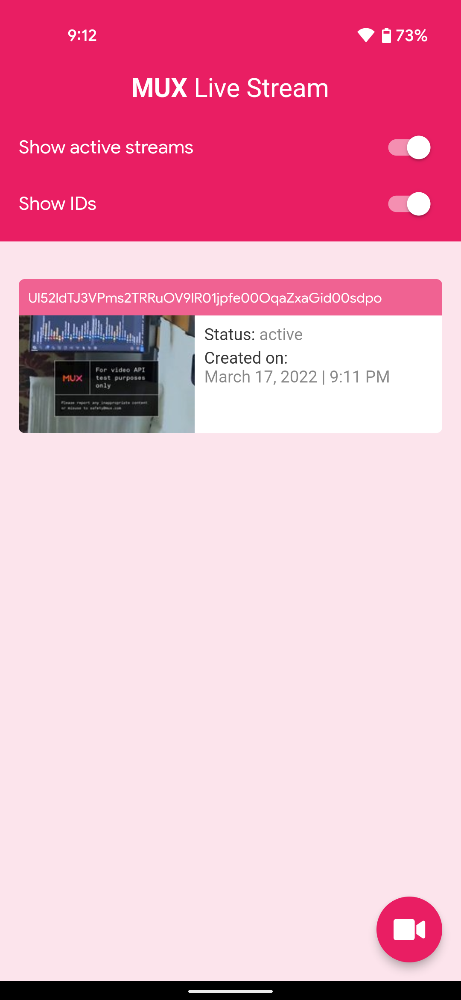
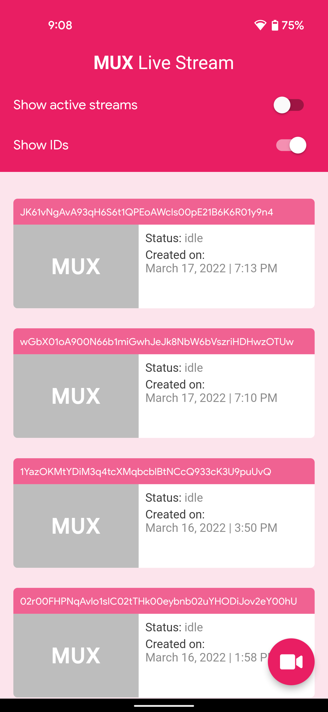
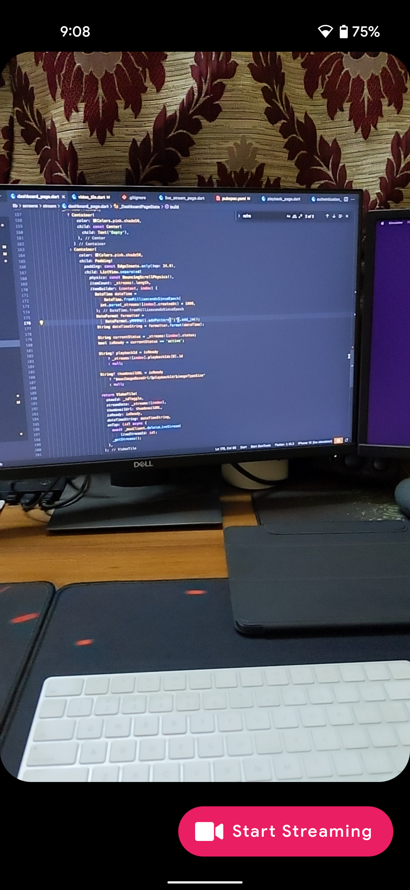
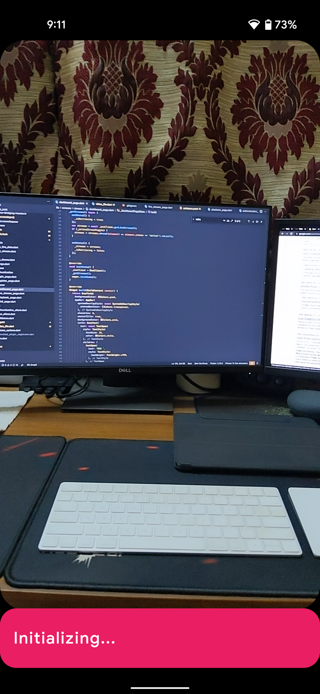
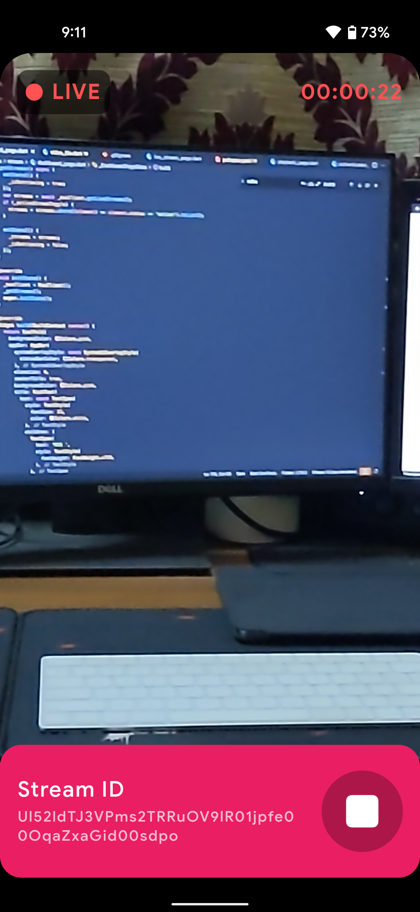

# Live Stream using MUX

Sample Flutter app for live streaming using MUX.

* Create and start live stream
* Get the list of streams
* Delete a live stream (long tap on a stream tile)

## Screenshots

### Dashboard Page

<p align="left">
  
  
</p>

### Live Stream Page

<p align="left">
  
  
  
</p>

## Usage

### For deploying Cloud Functions

Create `.env` file in the `functions` directory having the following:

```env
MUX_TOKEN_ID=<mux_token_id>
MUX_TOKEN_SECRET=<mux_token_secret>
```

This file can be generated by logging into MUX and generating an API Key (`.env` file can be generated from there).

## Plugins

* [video_stream](https://pub.dev/packages/video_stream)
* [video_player](https://pub.dev/packages/video_player)
* [wakelock](https://pub.dev/packages/wakelock)
* [firebase_core](https://pub.dev/packages/firebase_core)
* [cloud_functions](https://pub.dev/packages/cloud_functions)
* [firebase_auth](https://pub.dev/packages/firebase_auth)
* [intl](https://pub.dev/packages/intl)
* [font_awesome_flutter](https://pub.dev/packages/font_awesome_flutter)
* [permission_handler](https://pub.dev/packages/permission_handler)
